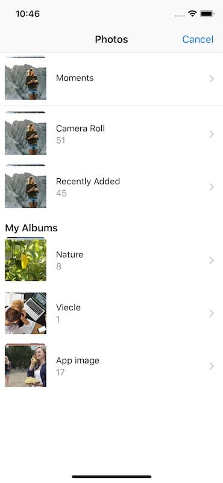

# SwiftImagePickerExample
Swift UIImagePickerController usage example.

# Reference

UIImagePickerController - UIKit | Apple Developer Documentation
https://developer.apple.com/documentation/uikit/uiimagepickercontroller

# UIImagePickerController album select

